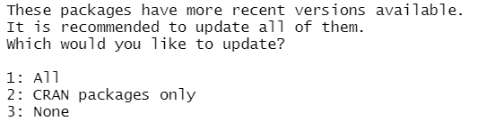

README
================

Jedid Ahn, Roberto Lentini, Logan Lim, Jeremy Tanuan, & Derek Beaton,
2021JAN25

# Standards (Shiny) App 

The Standards app is a heavy-duty app meant to cover multiple bases for
the ONDRI project and beyond. The current standards app will perform
standards checks in accordance with:

-   The general data structure we use

-   OND01

-   BEAM

-   OND06/REMINDD

-   and custom projects (with user input)

Additional information, documentation, and guides coming soon.

-   Install [R](https://cran.r-project.org/) first and then
    [RStudio](https://rstudio.com/products/rstudio/download/). Please
    choose the correct installer carefully as it will depend on your
    computer’s operating system.

 

-   Download and install the shiny app directly with the following lines
    of code:

<!-- -->

      if (!require("devtools")){
        install.packages("devtools")
      }
      devtools::install_github(repo = "ondri-nibs/standards_app")

 

-   Type `ONDRIStandardsApp::installPackages()` to install any missing
    packages and/or dependencies. If you get the following message in
    your RStudio console, please type 3.   
    

 

-   When installation is complete, type `ONDRIStandardsApp::runApp()` to
    open the app.
