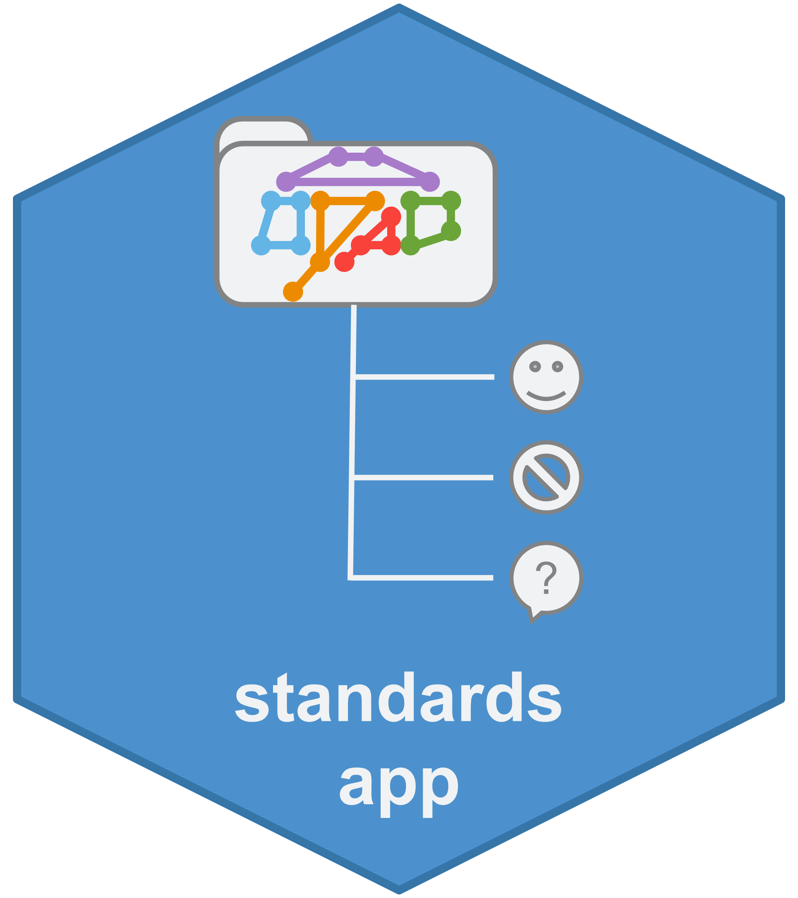

Standards
================

# Standards (Shiny) App 

The Standards app is a heavy-duty app meant to cover multiple bases for
the ONDRI project and beyond. The current standards app will perform
standards checks in accordance with:

  - The general data structure we use

  - OND01

  - BEAM

  - OND06/REMINDD

  - and custom projects (with user input)

Additional information, documentation, and guides coming soon.
